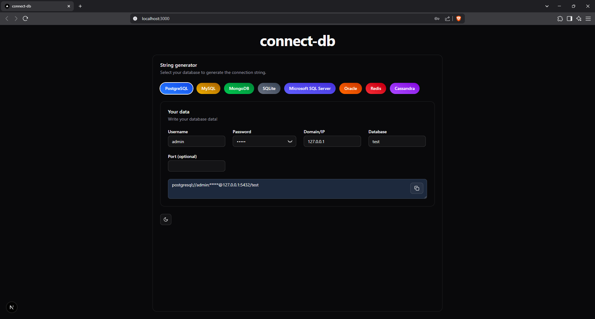

# 🔌 Connect-DB – Connection String Generator

Easily generate database connection strings for popular databases with a clean UI powered by Next.js, Tailwind CSS, and shadcn/ui.



---

## 🚀 Features

- 🎨 Elegant gradient UI using Tailwind and shadcn/ui
- 🔎 Supports over 15 databases:
  - PostgreSQL
  - MySQL
  - MongoDB
  - SQLite
  - Microsoft SQL Server
  - Oracle
  - Redis
  - Cassandra
- ⚡ Instant connection string preview
- 🌓 Dark mode ready

---

## 🧪 Tech Stack

- [Next.js 15](https://nextjs.org/)
- [Tailwind CSS](https://tailwindcss.com/)
- [shadcn/ui](https://ui.shadcn.com/)
- [TypeScript](https://www.typescriptlang.org/)

---

## 📦 Installation

```bash
git clone https://github.com/Tobias2510/connect-db.git
cd connect-db
npm install
npm run dev
```

## 🛠 Usage

1. Select your database from the colorful list of buttons.
2. Fill in your credentials (username, password, host, etc.).
3. Get a ready-to-copy connection string!

## ✨ Contributions

Feel free to open issues or pull requests to add more databases, improve logic, or enhance the UI.
